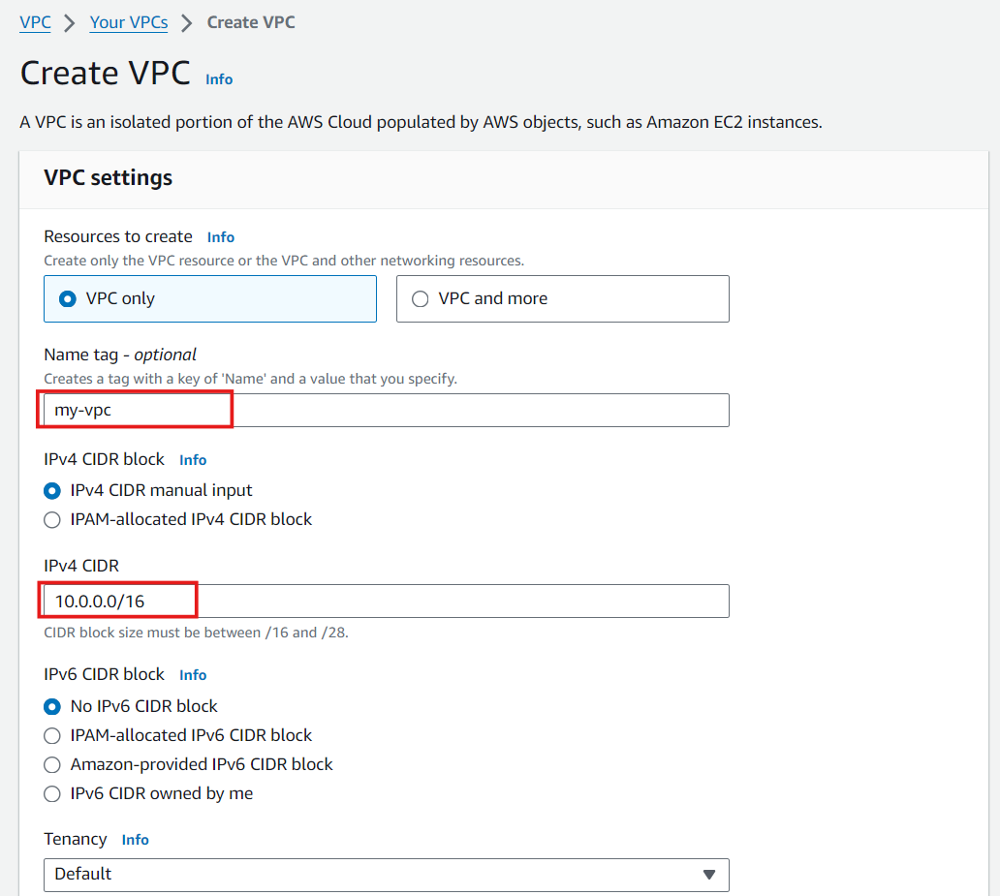
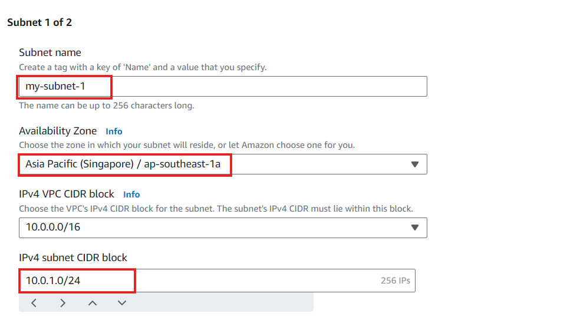
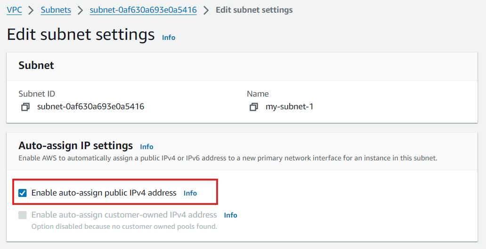
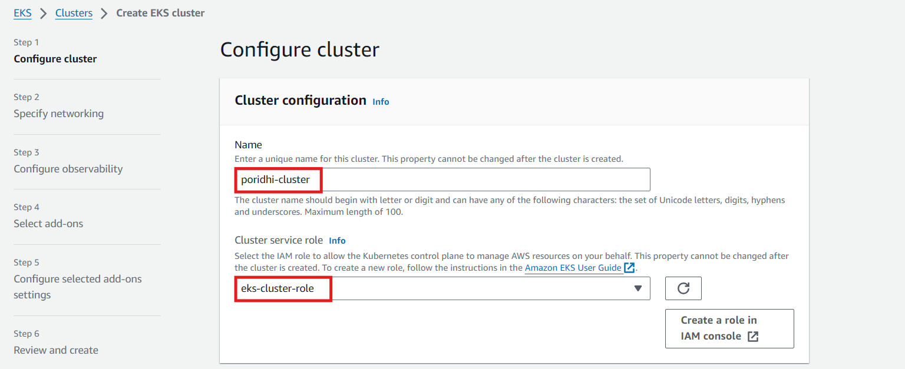
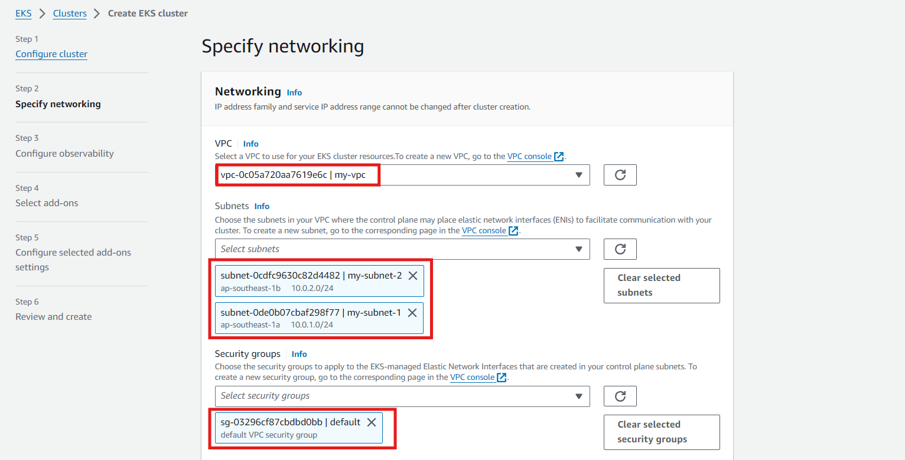
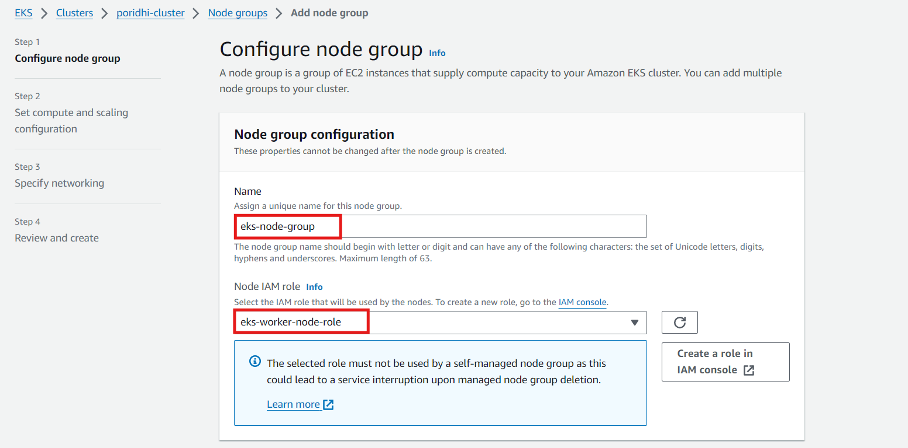
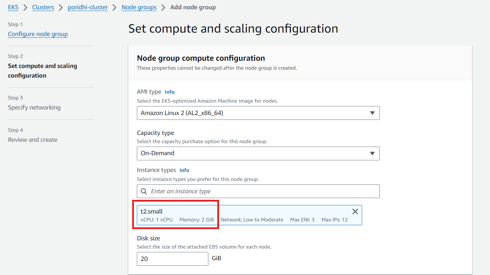
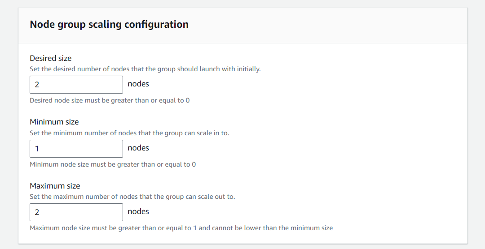
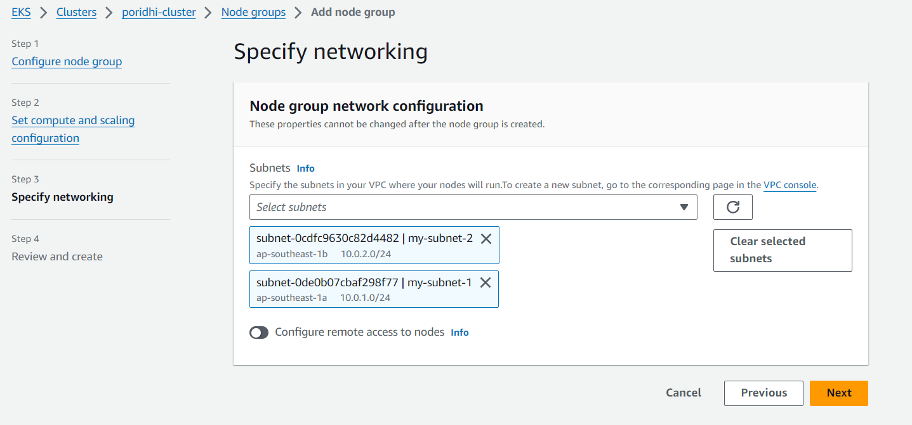

# Creating an EKS Cluster and Node Group Using the AWS Management Console

In this lab, you'll manually set up an EKS (Elastic Kubernetes Service) cluster. By the end of this guide, you will have a functional EKS Cluster with a Node Group ready to deploy and manage containerized applications.

## Task Description
In this lab, we will:

Set up the necessary AWS infrastructure, including IAM roles, VPC, subnets, and security groups.
Create an Amazon EKS cluster with a Node Group.


## Amazon EKS Cluster

An Amazon EKS (Elastic Kubernetes Service) cluster is a fully managed Kubernetes control plane running on AWS. It provides the core Kubernetes infrastructure, including the API server, etcd (the key-value store for cluster data), and the core controllers. The EKS cluster automates the deployment, scaling, and operation of Kubernetes applications across a distributed system of Amazon EC2 instances. When you create an EKS cluster, AWS manages the availability and scalability of the control plane nodes, which run across multiple Availability Zones to ensure high availability.

## Node Group

A node group in Amazon EKS is a collection of Amazon EC2 instances that run your Kubernetes workloads. Each node group is associated with an EKS cluster and is responsible for providing the compute capacity for running your containerized applications.

## Prerequisites

Before starting, ensure you have:

- AWS CLI installed and configured on your local machine.
- `kubectl` (Kubernetes CLI) installed.

## Configure AWS CLI

Configure AWS CLI with the necessary credentials. Run the following command and follow the prompts to configure it:

```bash
aws configure
```

This command sets up your AWS CLI with the necessary credentials, region, and output format.


You will find the `AWS Access key` and `AWS Seceret Access key` on Lab description page,where you generated the credentials.


## Installing `kubectl`

Download the kubectl Binary using:

```sh
curl -LO "https://dl.k8s.io/release/$(curl -L -s https://dl.k8s.io/release/stable.txt)/bin/linux/amd64/kubectl"
```

Make the Binary Executable and Move the kubectl binary to `/usr/local/bin`:

```sh
chmod +x kubectl
sudo mv kubectl /usr/local/bin/
```

Verify the Installation:

```sh
kubectl version --client
```


## Step 1: Setup VPC for EKS Cluster

### Create VPC

1. In the **AWS Management Console**, navigate to **VPC**.
2. Choose **Create VPC** > **VPC Only**.
3. Enter a name, e.g., `my-vpc`.
4. Set CIDR block (e.g., `10.0.0.0/16`).

    

### Create subnets
1. Select VPC.
2. Create two public subnets in different availability zones:

    - Name: `my-subnet-1`
    - CIDR: `10.0.1.0/24`
    - Availability zone: `ap-southeast-1a`

    

    Similarly create another one:    
    - Name: `my-subnet-2`
    - CIDR: `10.0.2.0/24`
    - Availability zone: `ap-southeast-1b`

3. For each subnet go to **Edit subnet settings** and enable `Auto-assign IP`.

    


### Create Internet Gateway and Route Table
1. Create an **Internet Gateway** `my-igw` and attach it to the VPC.
2. Configure **Route Tables**:
   - Name: `my-rt` 
   - Associate the public subnets with a route table
   - Add route route to the internet gateway.
   
    

Here is our expected resource-map of the VPC:


## Step 2: Create and Configure the EKS Cluster

### Create an IAM Role for EKS

1. Go to the **AWS Management Console** and navigate to **IAM**.
2. Select **Roles** > **Create Role**.
3. Choose **`EKS`** as the trusted entity and select **`EKS - Cluster`**.
4. Click **Next** and attach the policy **`AmazonEKSClusterPolicy`**.
5. Name the role **`eks-cluster-role`** and click **Create Role**.

### Create an IAM Role for Worker Nodes

1. In the IAM Console, go to **Roles** > **Create Role**.
2. Choose **`EC2`** as the trusted entity.
3. Attach the following policies:
   - `AmazonEKSWorkerNodePolicy`
   - `AmazonEC2ContainerRegistryReadOnly`
   - `AmazonEKS_CNI_Policy`
4. Name the role **`eks-worker-node-role`** and click **Create Role**.


### Create the EKS Cluster

1. Go to the **EKS Console** and click **Create Cluster**.
2. Enter the **Cluster name** (e.g., `pac-man-cluster`).
3. Select the **Version** (latest stable version).
4. Choose the **Role name** created for the EKS cluster (`eks-cluster-role`).

    

5. Select **VPC** and **Subnets** created in the previous step.
6. Leave the `default` security group.

    

7. Since I don't have any specific requirements at the moment, I'm choosing to skip this step and proceed by clicking the `Next` button.
8. Click **Create**.

    

    **Note:** It can take 10-20 minutes for the cluster to be created. Wait till the status is `Active`.


### Create Worker Nodes (Node Group)

1. In the **EKS Console**, go to your cluster and select **Compute** > **Add Node Group**.
2. Enter a **Node group name** (e.g., `eks-node-group`).
3. Select the **Node IAM role** created earlier (`eks-worker-node-role`).

    

4. Configure the **Compute and Scaling** settings:
   - **Instance Type**: Choose your desired instance type (e.g., `t2.small`).

    

   - **Scaling configuration**: Set the desired, minimum, and maximum number of nodes.

    

5. Select **Subnets** for the worker nodes.

    
    
6. Click **Create**.


Wait till the status of the node group is `Active`.

## Step 3: Update kubeconfig to connect to your cluster

To manage your EKS cluster with `kubectl`, update the `kubeconfig` file with the following command:

```bash
aws eks --region <your-region-code> update-kubeconfig --name <your-eks-cluster>
```

### Example:

```bash
aws eks --region ap-southeast-1 update-kubeconfig --name poridhi-cluster
```

This ensures that `kubectl` is correctly configured to communicate with your EKS cluster.

## Step 4: Verify the Setup

Finally, verify that your nodes are up and running by checking their status:

```bash
kubectl get nodes
```

You should see a list of nodes from your node group, confirming that the EKS cluster and node group are successfully set up.


## Conclusion

Congratulations on successfully setting up your AWS EKS cluster! 🎉 Take pride in your achievement and continue to explore and innovate.

Stay curious and keep learning.
