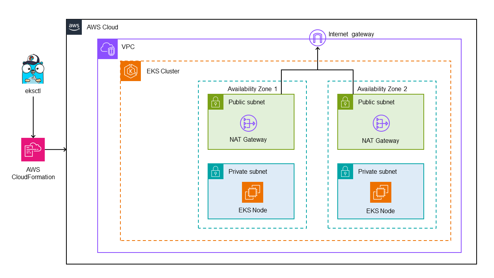
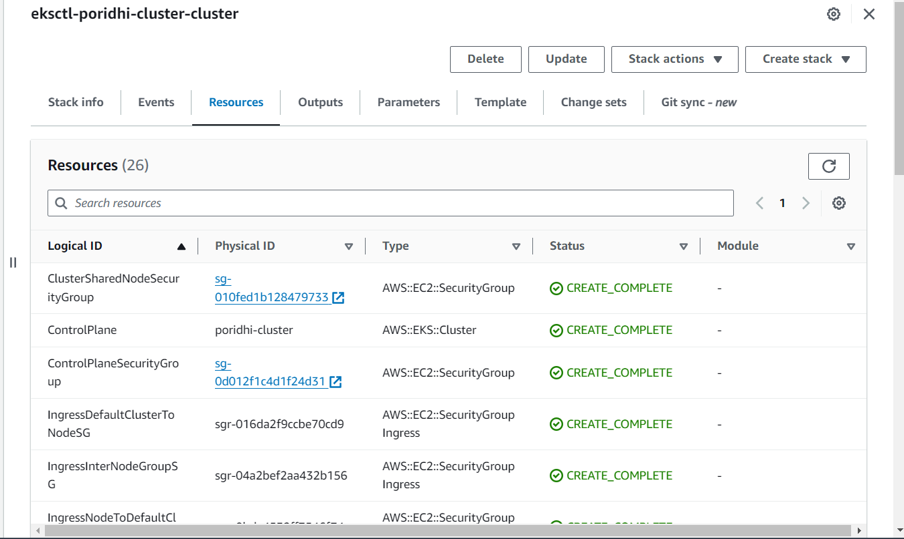
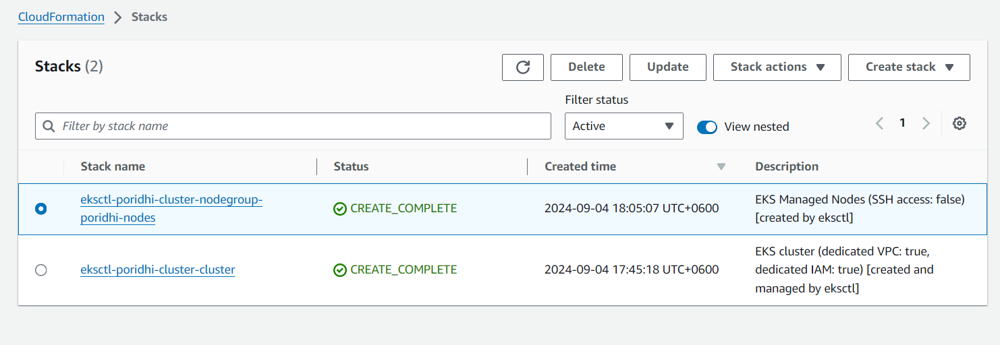
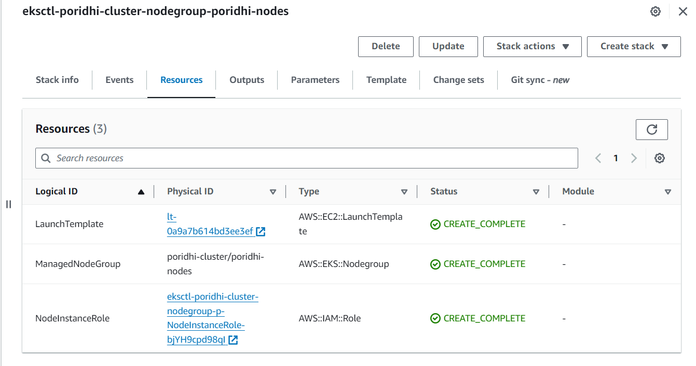

# Setting Up an Amazon EKS Cluster and Node Group Using `eksctl`

Amazon Elastic Kubernetes Service (EKS) provides a fully managed Kubernetes environment, integrating seamlessly with AWS services. This guide walks you through setting up an EKS cluster and adding a node group using `eksctl`.



## What is eksctl?

`eksctl` is a simple command-line tool for creating and managing Kubernetes clusters on Amazon EKS. It is an open-source project developed and maintained by Weaveworks. The primary goal of `eksctl` is to provide an automated and streamlined way to deploy and manage EKS clusters, reducing the complexity and manual effort involved in the process. With `eksctl`, you can easily create and manage EKS clusters, node groups, and other related resources using simple commands.


## Prerequisites

Before you begin, ensure the following:
- **AWS CLI**: Installed and configured.
- **IAM User/Role**: Ensure the IAM user or role has necessary permissions to create and manage EKS clusters and EC2 instances.
- AWS CLI installed and configured on your local machine.
- `kubectl` (Kubernetes CLI) installed.

## Configure AWS CLI

Configure AWS CLI with the necessary credentials. Run the following command and follow the prompts to configure it:

```bash
aws configure
```

This command sets up your AWS CLI with the necessary credentials, region, and output format.


You will find the `AWS Access key` and `AWS Seceret Access key` on Lab description page,where you generated the credentials.


## Installing `kubectl`

Download the kubectl Binary using:

```sh
curl -LO "https://dl.k8s.io/release/$(curl -L -s https://dl.k8s.io/release/stable.txt)/bin/linux/amd64/kubectl"
```

Make the Binary Executable and Move the kubectl binary to `/usr/local/bin`:

```sh
chmod +x kubectl
sudo mv kubectl /usr/local/bin/
```

Verify the Installation:

```sh
kubectl version --client
```


## Installing `eksctl`

`eksctl` is a command-line utility that simplifies the creation and management of EKS clusters. Follow the very simple steps below to install `eksctl`.

```bash
curl --location "https://github.com/weaveworks/eksctl/releases/latest/download/eksctl_$(uname -s)_amd64.tar.gz" | tar xz -C /tmp
sudo mv /tmp/eksctl /usr/local/bin
```

After installation, you can verify that `eksctl` is correctly installed by running:

```bash
eksctl version
```

This should display the version of `eksctl` installed on your system.


## Step 1: Create an EKS Cluster

To create an EKS cluster in your desired region, run the following command:

```bash
eksctl create cluster \
  --name <cluster-name> \
  --version <kubernetes-version> \
  --region <aws-region> \
  --zones <availability-zones> \
  --without-nodegroup
```

The command creates an Amazon EKS cluster with the specified name, Kubernetes version, AWS region, and availability zones, without creating any worker node groups initially.

### Example:

```bash
eksctl create cluster \
  --name poridhi-cluster \
  --version 1.30 \
  --region ap-southeast-1 \
  --zones ap-southeast-1a,ap-southeast-1b \
  --without-nodegroup
```

This command creates an Amazon EKS cluster named `poridhi-cluster` using Kubernetes version 1.30 in the `ap-southeast-1` AWS region. The cluster spans two availability zones, `ap-southeast-1a` and `ap-southeast-1b`, and is created without any initial worker node groups.

### Verification:

Once the cluster is created, verify its existence with:

```bash
eksctl get cluster
```

This command lists all existing EKS clusters, providing details such as cluster names, regions, and statuses. It will take approximately 10 to 20 minutes to create the cluster.


You can also verify that the cluster has been created successfully by using the AWS Console. Navigate to the `CloudFormation` section to check the status of your cluster's stack and ensure it shows as successfully created.


You can also view the resources of the cluster that has been created.



## Step 2: Add a Node Group

After creating the EKS cluster, you can add a node group that will consist of EC2 instances acting as worker nodes.

Run the following command to create a node group:

```bash
eksctl create nodegroup \
  --cluster=<cluster-name> \
  --name=<nodegroup-name> \
  --region=<aws-region> \
  --node-type=<instance-type> \
  --managed \
  --nodes=<desired-node-count> \
  --nodes-min=<minimum-node-count> \
  --nodes-max=<maximum-node-count>
```

Replace the following placeholders with your specific values:

1. **`<cluster-name>`**: Name of your existing EKS cluster.
2. **`<nodegroup-name>`**: Name to assign to the node group.
3. **`<aws-region>`**: AWS region where your EKS cluster is located.
4. **`<instance-type>`**: EC2 instance type for the nodes in the node group.
5. **`<desired-node-count>`**: Number of nodes to start with in the node group.
6. **`<minimum-node-count>`**: Minimum number of nodes to maintain in the node group (used for auto-scaling).
7. **`<maximum-node-count>`**: Maximum number of nodes that can be scaled up in the node group (used for auto-scaling).

### Example:

```bash
eksctl create nodegroup \
  --cluster=poridhi-cluster \
  --name=poridhi-nodes \
  --region=ap-southeast-1 \
  --node-type=t2.small \
  --managed \
  --nodes=2 \
  --nodes-min=1 \
  --nodes-max=2
```

This command creates a managed node group named `poridhi-nodes` in the `poridhi-cluster` Amazon EKS cluster, located in the `ap-southeast-1` AWS region. The node group uses `t2.small` EC2 instances, with a desired number of 2 nodes. The node group will automatically scale between a minimum of 1 node and a maximum of 2 nodes based on demand.

### Verification

You can verify that the nodegroup has been created successfully by using the AWS Console. Navigate to the `CloudFormation` section to check the status of your nodegroup's stack and ensure it shows as successfully created.



You can also view the resources of the nodegroup that has been created.



## Step 3: Configure `kubectl`

To manage your EKS cluster with `kubectl`, update the `kubeconfig` file with the following command:

```bash
aws eks --region <your-region-code> update-kubeconfig --name <your-eks-cluster>
```

### Example:

```bash
aws eks --region ap-southeast-1 update-kubeconfig --name poridhi-cluster
```

This ensures that `kubectl` is correctly configured to communicate with your EKS cluster.

## Step 4: Verify the Setup

Finally, verify that your nodes are up and running by checking their status:

```bash
kubectl get nodes
```

You should see a list of nodes from your node group, confirming that the EKS cluster and node group are successfully set up.


## Conclusion

By following these steps, you can efficiently create an Amazon EKS cluster and node group using `eksctl`. This streamlines the deployment and scaling of containerized applications on AWS.

Congratulations on successfully setting up your AWS EKS cluster! 🎉 Take pride in your achievement and continue to explore and innovate.

Stay curious and keep learning.
