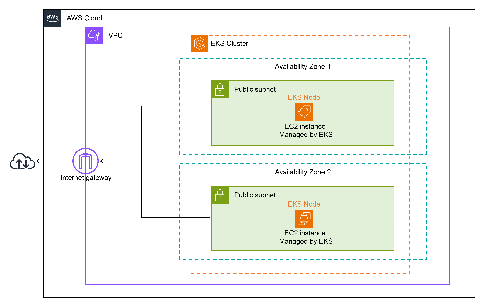
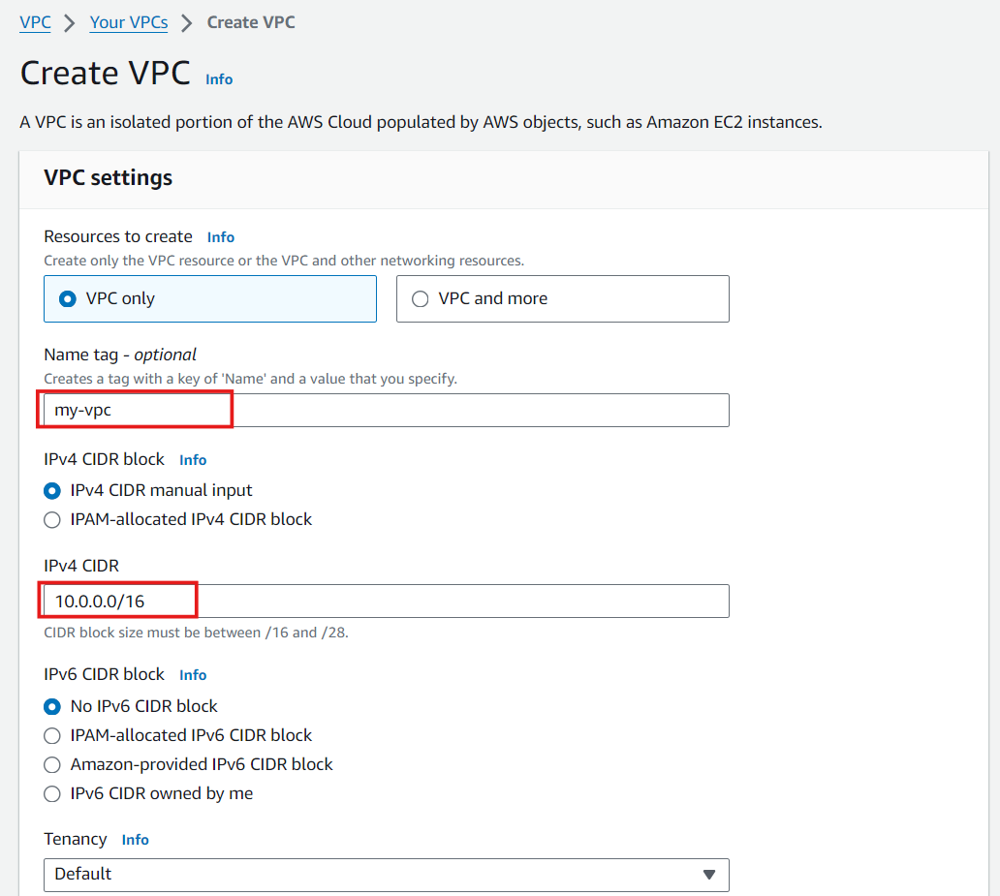
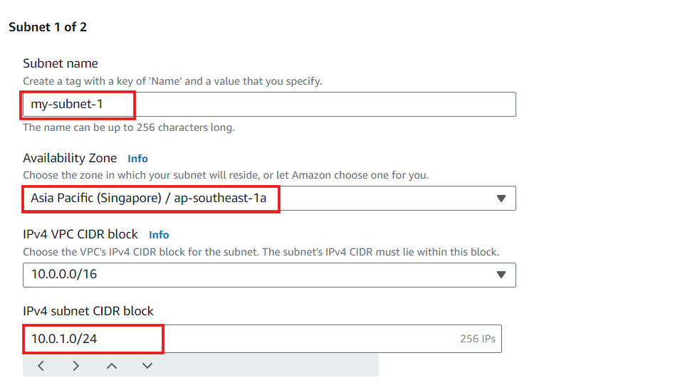
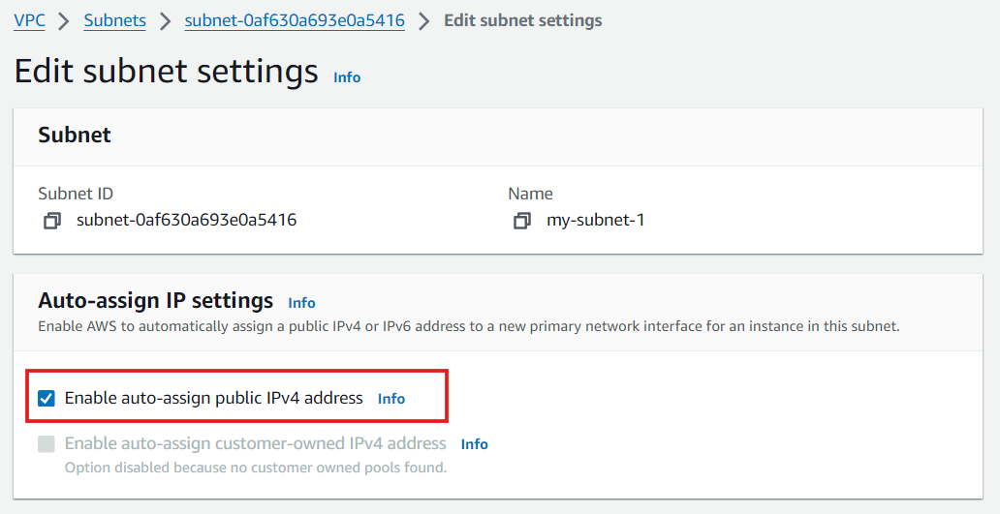
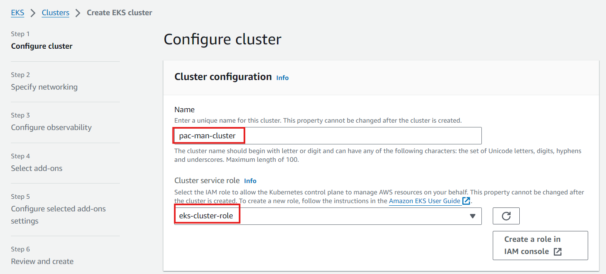
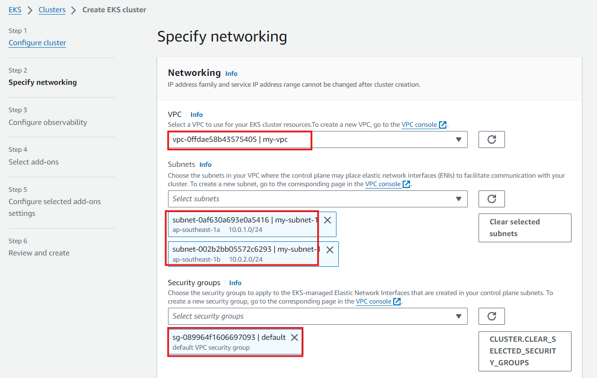
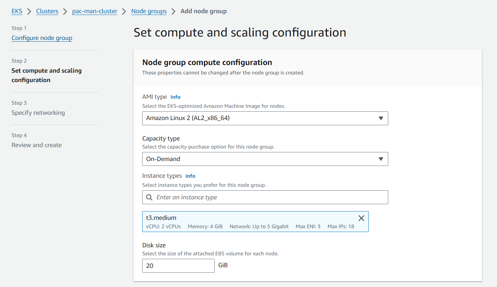
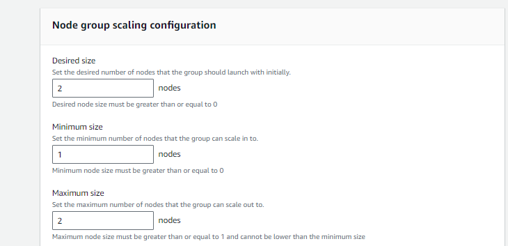

# Deploying an EKS Cluster and Pac-Man Web Application

In this lab, you'll manually set up an EKS (Elastic Kubernetes Service) cluster on AWS and deploy an Pac-Man web game application to it using a docker image of the application. You'll also learn how to manage Kubernetes resources, scale deployments, and test your application's functionality.

## Prerequisites

Before starting, ensure you have:

- AWS CLI installed and configured on your local machine.
- `kubectl` (Kubernetes CLI) installed.
- Docker installed (if you want to build or customize the container image).
- Basic knowledge of Kubernetes and AWS services.

## Task Description
In this lab, we will:

Set up the necessary AWS infrastructure, including IAM roles, VPC, subnets, and security groups.
Deploy an Amazon EKS cluster and configure it for your application.



Deploy the Pac-Man application to the EKS cluster using Kubernetes manifests.
Expose the application using Kubernetes services.


Scale the application to handle varying traffic loads.
Test and verify that the application is working as expected.


## Step 1: Setup VPC for EKS Cluster

### Create VPC

1. In the **AWS Management Console**, navigate to **VPC**.
2. Choose **Create VPC** > **VPC Only**.
3. Enter a name, e.g., `my-vpc`.
4. Set CIDR block (e.g., `10.0.0.0/16`).

    

### Create subnets
1. Select VPC.
2. Create two public subnets in different availability zones:

    - Name: `my-subnet-1`
    - CIDR: `10.0.1.0/24`
    - Availability zone: `ap-southeast-1a`

    

    Similarly create another one:    
    - Name: `my-subnet-2`
    - CIDR: `10.0.2.0/24`
    - Availability zone: `ap-southeast-1b`

3. For each subnet go to **Edit subnet settings** and enable `Auto-assign IP`.

    


### Create Internet Gateway and Route Table
1. Create an **Internet Gateway** `my-igw` and attach it to the VPC.
2. Configure **Route Tables**:
   - Name: `my-rt` 
   - Associate the public subnets with a route table
   - Add route route to the internet gateway.
   
    


Here is our expected resource-map of the VPC:


## **Step 2: Create and Configure the EKS Cluster**

### Create an IAM Role for EKS

1. Go to the **AWS Management Console** and navigate to **IAM**.
2. Select **Roles** > **Create Role**.
3. Choose **`EKS`** as the trusted entity and select **`EKS - Cluster`**.
4. Click **Next** and attach the policy **`AmazonEKSClusterPolicy`**.
5. Name the role **`eks-cluster-role`** and click **Create Role**.

### Create an IAM Role for Worker Nodes

1. In the IAM Console, go to **Roles** > **Create Role**.
2. Choose **`EC2`** as the trusted entity.
3. Attach the following policies:
   - `AmazonEKSWorkerNodePolicy`
   - `AmazonEC2ContainerRegistryReadOnly`
   - `AmazonEKS_CNI_Policy`
4. Name the role **`eks-worker-node-role`** and click **Create Role**.


### Create the EKS Cluster

1. Go to the **EKS Console** and click **Create Cluster**.
2. Enter the **Cluster name** (e.g., `pac-man-cluster`).
3. Select the **Version** (latest stable version).
4. Choose the **Role name** created for the EKS cluster (`eks-cluster-role`).

    

5. Select **VPC** and **Subnets** created in the previous step.
6. Leave the `default` security group.

    

7. Click **Create**.

    

    **Note:** It can take a few minutes for the cluster to be created. Wait till the status is `Active`.


### Create Worker Nodes (Node Group)

1. In the **EKS Console**, go to your cluster and select **Compute** > **Add Node Group**.
2. Enter a **Node group name** (e.g., `eks-node-group`).
3. Select the **Node IAM role** created earlier (`eks-worker-node-role`).
4. Configure the **Compute and Scaling** settings:
   - **Instance Type**: Choose your desired instance type (e.g., `t3.medium`).

    

   - **Scaling configuration**: Set the desired, minimum, and maximum number of nodes.

    

5. Select **Subnets** for the worker nodes.
6. Click **Create**.


Wait till the status of the node group is `Active`.

## Step 3: pdate kubeconfig to Connect to Your Cluster

Open terminal on your local machine and do the following:

1. AT first configure AWS CLI using the following command:

    ```bash
    aws configure
    ```

    Provide AWS secret key, secret access key and region . 

2. Run the following command to update your `kubeconfig` file to connect to your cluster:

   ```bash
   aws eks --region ap-southeast-1 update-kubeconfig --name pac-man-cluster
   ```

3. Confirm the connection:

   ```bash
   kubectl get nodes
   ```

   You should see the worker nodes in a "Ready" state.

## Step 4:Deploy the Application to the EKS Cluster

### Create a Namespace for the Application

Create a namespace called `pac-man`:

```bash
kubectl create namespace pac-man
```

### Create and apply the Kubernetes Manifest for deployment

Create a Kubernetes deployment file `pacman-deploy.yaml` with the following content:

```yaml
apiVersion: apps/v1
kind: Deployment
metadata:
  name: pacman-app
  namespace: pac-man
spec:
  replicas: 1
  selector:
    matchLabels:
      app: pacman-app
  template:
    metadata:
      labels:
        app: pacman-app
    spec:
      containers:
        - name: pacman-app
          image: uzyexe/pacman:latest
          ports:
            - containerPort: 80
---

apiVersion: v1
kind: Service
metadata:
  name: pacman-app
  namespace: pac-man
spec:
  type: LoadBalancer
  selector:
    app: pacman-app
  ports:
    - protocol: TCP
      port: 80
      targetPort: 80
```

This configuration defines a Kubernetes Deployment and a LoadBalancer Service for the Pac-Man web application. The Deployment manages the deployment of the Pac-Man app within the `pac-man` namespace. It specifies that a single replica of the pod should be created, using the Docker image `uzyexe/pacman:latest`. The pod is labeled with `app: pacman-app`, which is used for selecting the pod in the Service configuration. 

The Service is of type `LoadBalancer`, which exposes the application on port 80, making it accessible externally. The service routes incoming traffic on port 80 to the corresponding port on the pod, ensuring the Pac-Man app is available to users.


#### Save the file and apply it:

```bash
kubectl apply -f pacman-deploy.yaml
```


### Verify the Deployment and Services

Check the status of your deployments and service:

```bash
kubectl get all -n pac-man
```


Note the **EXTERNAL-IP** of the `pacman-app` service. This is the LoadBalancer IP you will use to access the Pac-Man application.

### Test the Application
Open a browser and navigate to the **EXTERNAL-IP** of the `pacman-app` service and Verify that the Pac-Man game is loading and playable.


## **Step 5: Scale the Kubernetes Web Application**

### Scale Up the Application

1. Scale up the backend and frontend pods:

   ```bash
   kubectl scale deployment pacman-app --replicas=2 -n pac-man
   ```

2. Confirm the scaling:

   ```bash
   kubectl get deployments -n pac-man
   ```

    

### Test the Scaled Application

- Refresh the application in the browser and ensure it is still working as expected.

### Scale Down the Application

1. Scale down the backend and frontend pods:

   ```bash
   kubectl scale deployment pacman-app --replicas=1 -n pac-man
   ```

2. Confirm the scaling:

   ```bash
   kubectl get deployments -n pac-man
   ```

   

### Final Testing

- Refresh the application once more to ensure it is functioning correctly.

## **Conclusion**

You have successfully set up an EKS cluster on AWS, deployed an HTML5 Pac-Man web application, and managed Kubernetes resources manually. You've also learned how to scale the application up and down, ensuring it's running smoothly. Great job!

